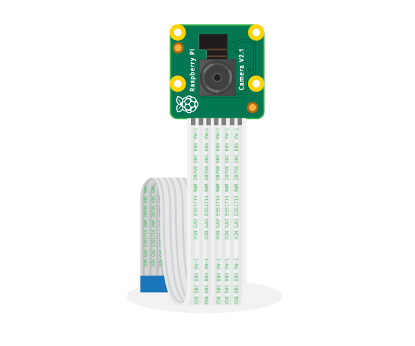

# Use RPi Camera in your Mini Pupper
## Step1: Connect Pi Camera to the Raspberry Pi 4B CSI Port
1. Ensure the Raspberry Pi is turned off and unplugged from the power source.
2. Locate the CSI (Camera Serial Interface) port on the Raspberry Pi 4B. This port is a rectangular-shaped connector located between the micro HDMI and audio ports.

3. Open the camera module's plastic tab by gently pulling it away from the circuit board.

1. Gently insert the ribbon cable into the camera module's connector with the shiny contacts facing the circuit board.
2. Push the plastic tab back into place to secure the ribbon cable.
3. Gently insert the other end of the ribbon cable into the CSI port on the Raspberry Pi 4B, making sure that the shiny contacts are facing the micro HDMI port.
4. Push the ribbon cable firmly into the CSI port, ensuring that it is properly connected.


Remember to handle the ribbon cable and connector carefully to avoid damage, and double-check that everything is properly aligned before inserting or securing the cable.

For additional information, please refer to the official Raspberry Pi documentation on [getting started with Picamera](https://projects.raspberrypi.org/en/projects/getting-started-with-picamera), which includes these images.

> These images are provided by [Raspberry Pi Foundation](http://www.raspberrypi.org), and licenced under a [Creative Commons Attribution 4.0 International License](http://creativecommons.org/licenses/by-sa/4.0/).

## Step2: Install the camera driver and configure Raspberry Pi

```bash
cd ~/mini_pupper_bsp/RPiCamera  # To RPiCamera directory
```

```bash
. install.sh  # Set camera configurations
```

## Step3: Test camera


- Camera ffplay test
```bash
cd ~/mini_pupper_bsp/demos  # To demos directory
```

```bash
sudo apt install python-is-python3 -y  # install python
python camera_ffplay_test.py  # run ffplay test demo
```
-  Camera image in RViz
TODO

